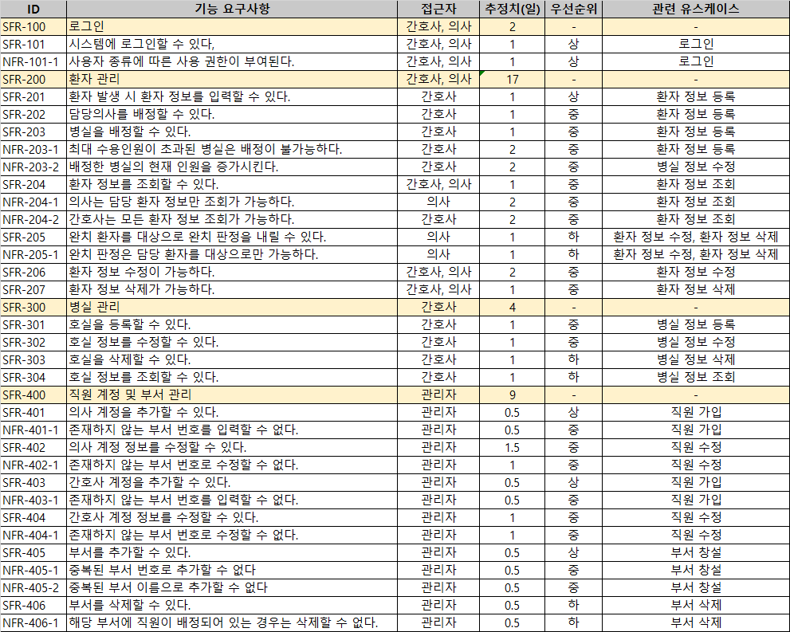
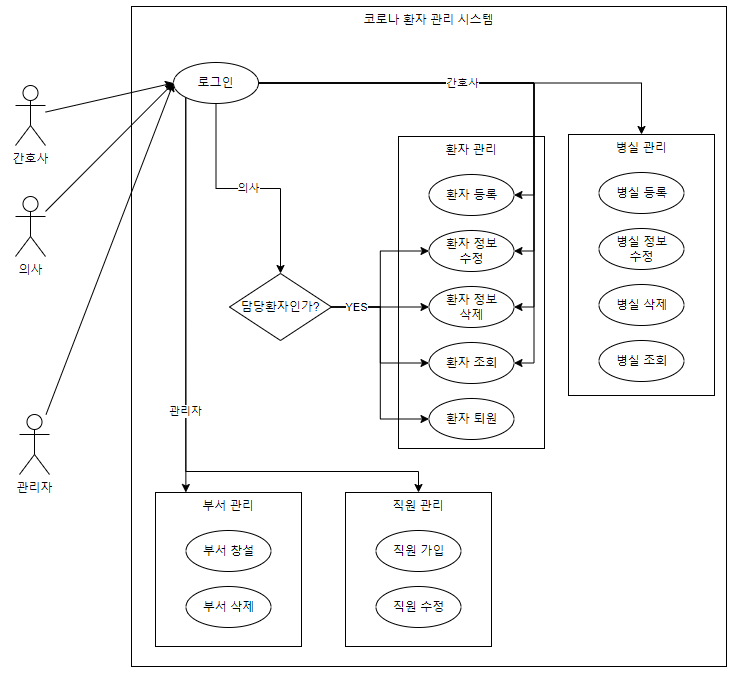
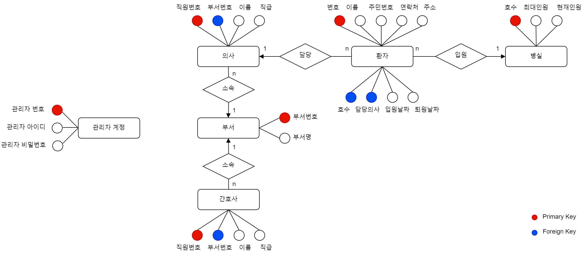

# 2021년도 3학년 2학기 데이터베이스응용
<h2 align=left>3분반 6조 코로나 환자 관리 프로그램</h2>

## 목차

1. [배경](#1-배경)
2. [개발 환경](#2-개발-환경)
3. [분석 및 설계](#3-분석-및-설계)
4. [데모 영상](#4-데모-영상)

## 1. 배경

&nbsp;코로나19로 인해 확진자의 격리 및 치료가 급격히 증가하고 있다. 하지만 병원에서 급격한 격리환자를 수용할 병실 관리가 부족한 현실이다.<br>
&nbsp;따라서 코로나 환자 관리 프로그램을 구축하여 병원에서 격리환자의 정보 및 격리상태를 체계적으로 관리하고, 병실의 수용인원을 파악하여 원활한 호실 관리를 하도록 도와줄 것이다.

&nbsp;또한 수업 시간에 배웠던 DB 명령어들을 충분히 활용할 수 있는 프로그램이라 생각하여 고안하게 되었다.

## 2. 개발 환경

```
* DB : Oracle 11g
* Programming Language : Pro*C
* IDE : Visual Studio 2019. SQL Developer
```

## 3. 분석 및 설계

1. 기능 요구사항</br>
<p align="center">
</p>

2. 유스케이스 다이어그램<br>
<p align="center">
</p>

3. ERD
<p align="center">
</p>

## 4. 데모 영상

[](https://youtu.be/xyZ3uUWMG5c)
